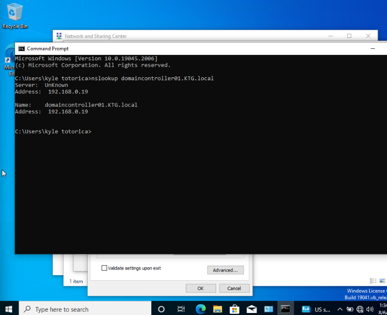
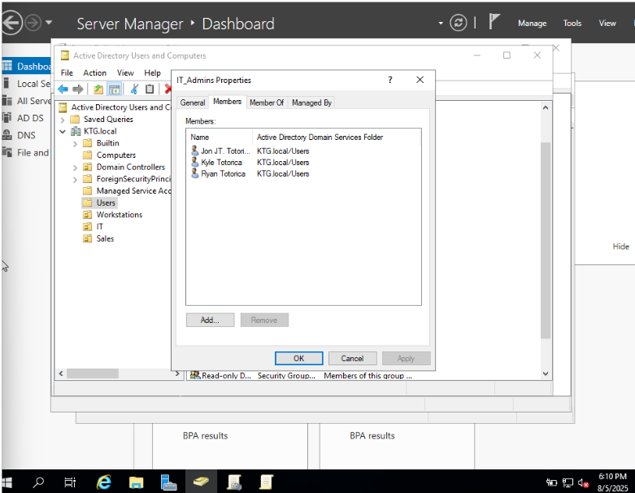
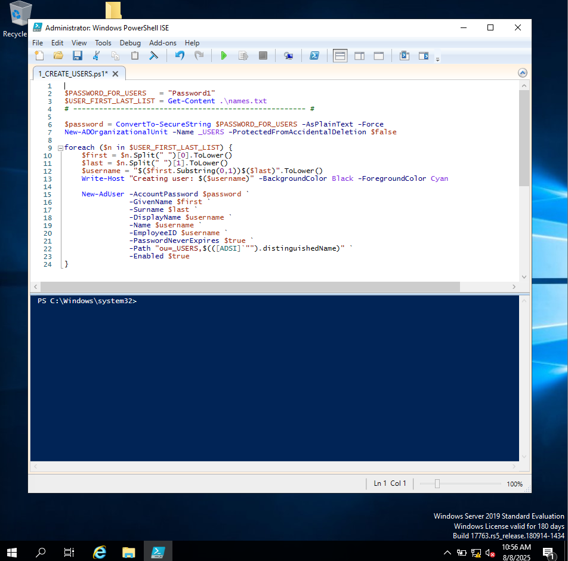
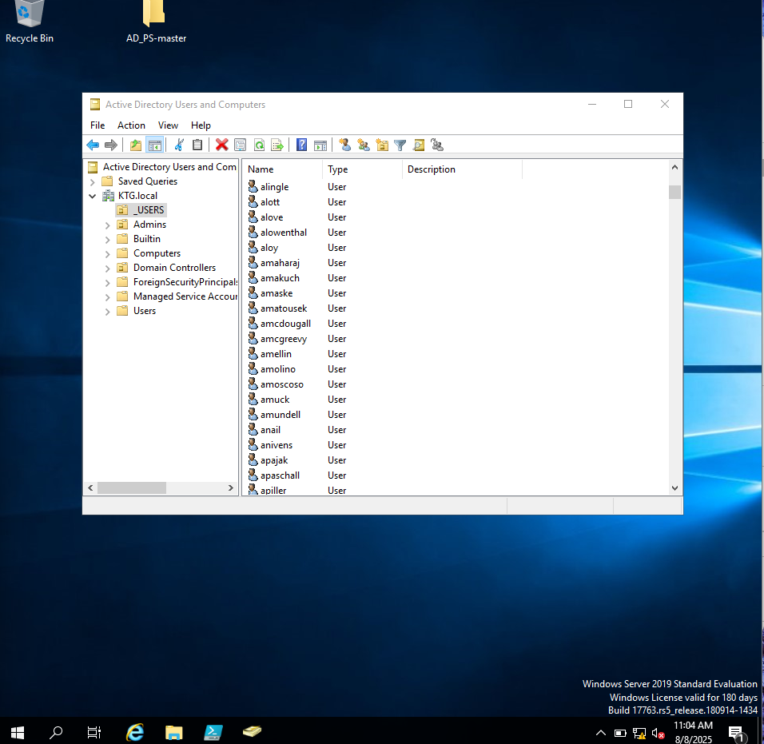

# Windows-Domain-Active-Directory-Lab---Home-Lab
Set up a virtualized Windows Domain environment that implemented Active Directory Domain Services (AD DS). Created and managed Organizational Units(OUs), Users, and Groups, as well as configured Group Policy Objectives(GPOs) that enforced lock screen and UI settings. Installed and configured DHCP for automatic IP address assignment. 

#Goal
Set up a basic Windows Domain environment with:
-Active Directory Domain Services (AD DS)
-Configure an internal DNS Server for name resolution 
-A domain created - joined a Windows 10 client
-Create and manage users and groups
-Apply Group Policy Objects(GPOs)

#Lab Environment
Role                         OS                              Purpose
Domain Controller     Windows Server 2019            Domain Controller and DNS
Client Machine           Windows 10                     Domain-joined Client

#Steps
Configure Network Adapters
Adapter 1 (NAT):Internet access
Adapter 2 (Internal Network): Enable communication with the client. Both the server and the client machines run on same network (interface 1 for client)

Active Directory Configuration
1. Promoted the server machine to a domain controlller for the new domain KTG.local
2. Used Add roles and features wizard within server manager to install
   -Active Directory Domain Services (AD DS)
   -DNS Server
3.Rebooted the Server and confirmed that the server now had Primary Domain Controller functionallity

Install and Configured DHCP
1. Installed DHCP through server manager and authorized DHCP using the domain credentials
2. Created a new DHCP scope for incoming devices (172.16.0.100 - 200)
3. Set the Server to act as the router andd default gateway

DNS Configuration
1. Installed the DNS role through the server manager
2. I verified that DNS was installed and that there was a forward loopup zones that included a zone for the domain KTG.local
3. Set the preferred DNS server to 127.0.0.1 so it point to the local host
4. Once set up on the server I configured the Windows10 host by setting the perfered DNS Server to that of the controller (172.16.0.1)
5. Confirmed the functionality on the host through the command line

Client Configuration and Domain Join
1. Configured the client machine (Windows 10) to point to the domain controller (172.16.0.1)

3. Renamed my Client machine to Windows10
4. Joined the domain KTG.local
5. Rebooted the machine and logged in to it with a domain user account that I configured on the controller

6. After joining the Domain on the client machine, I confirmed that it was successful by moving to the controller and seeing the client show up in the active directory

User and Group Management
1. Created Organizational Units(OUs): Users, Computers, It
2. Created domain users: kyletotorica, jtotorica, rtotorica
3. Assigned the users to different groups: IT Admmmins, HR

Group Policy Configuration(GPO)
1. Created an Organizational Unit, moved the test domain user into this OU
2. Created new GPO's named KTG_LockScreenPloicy and KTG_PasswordManager

4. Configured these lockscreen and password GPO's enabling real world policies such as: setting a minumum password requirement and password complexity, 
5. Tested these GPO's on the Windows 10 client by restarting it and logging in as a domain user and verified the password requirements and the lock screen policy was enforced

Automated User Creation of 1000 Users Using PowerShell to Simulate an Enterprise Environment
1. The script I used

   -Created an Organizational Unit to hold all of the new user that will be created
   - Reads info on user data from a CSV file, 1000 randomly generated names
   -  Adds user account to the active directory in the OU created

What I Learned
-How Active Directory and DNS work together within a Windows domain
-How to promate a server into a domain controller
-How to properly configure a DNS zone and testing
-How to join a Windows client to a domain allowing for centrallized account management
   
